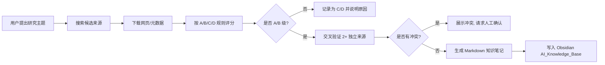

# knowledge-source-scoring

[](https://www.python.org/)
[](LICENSE)
[](docs/install-to-opencode.md)

> 一个 **Claude / OpenCode Skill** + 独立 Python 工具，帮你用可复现的规则评估网页来源可信度，并把筛选后的知识整理成新手友好的 **Obsidian Markdown 笔记**。

---

## 30 秒看懂

网上找学习资料时，你是不是经常遇到这些问题？

- ❌ 搜到的文章不知道靠不靠谱
- ❌ 好来源和好来源的说法互相矛盾
- ❌ 收藏了一堆网页，从来没整理成笔记
- ❌ 笔记软件之间无法互通

**knowledge-source-scoring** 的核心思路：

1. 先给每个网页来源打分（A/B/C/D 四级）
2. 用至少 2 个独立来源交叉验证关键结论
3. 只把可信内容整理成一份单文件 Markdown 笔记
4. 来源信息、评分、可信理由全部写在笔记末尾，随时可追溯

---

## 适合谁用

- 🎓 **学生 / 研究者**：写论文、查资料时快速判断来源可信度
- 🤖 **AI 从业者**：学习 Prompt 工程、RAG、Agent 时整理官方文档
- 📝 **知识工作者**：把碎片阅读整理成结构化个人知识库
- 🛠️ **AI 工具玩家**：把这套规则装进自己的 Claude / OpenCode Agent

---

## 快速开始

### 方式一：作为 OpenCode / Claude Code Skill 使用

```bash
git clone https://github.com/aaa949714447-cmyk/knowledge-source-scoring.git
cd knowledge-source-scoring

# 安装到 OpenCode（默认路径）
mkdir -p ~/.config/opencode/skills/knowledge-source-scoring
cp SKILL.md ~/.config/opencode/skills/knowledge-source-scoring/
cp -r references ~/.config/opencode/skills/knowledge-source-scoring/
cp -r scripts ~/.config/opencode/skills/knowledge-source-scoring/
```

重启 OpenCode 后，直接说：

> “我想研究‘提示词工程中的链式思考’，请帮我找靠谱来源并整理成 Obsidian 笔记。”

详细安装步骤见 [docs/install-to-opencode.md](docs/install-to-opencode.md)。

### 方式二：独立运行评分脚本

```bash
python3 scripts/download_source.py \
  --url "https://www.promptingguide.ai/zh/techniques/consistency" \
  --out ~/uumit-local-knowledge-base \
  --query "自我一致性提示技术是什么"
```

脚本会输出 JSON 评分结果，并在本地保存：

```text
~/uumit-local-knowledge-base/
└── sources/<slug>/
    ├── raw.html
    ├── text.txt
    ├── images.json
    └── metadata.json
```

---

## 工作流



---

## 评分策略（A/B/C/D 四级）

评分规则写在 `references/knowledge_source_policy.yaml` 中，六个维度：

| 维度 | 满分 | 说明 |
|------|------|------|
| 权威性 | 30 | 来源主体是否权威、稳定、可问责 |
| 可追溯性 | 20 | 作者、时间、版本、引用是否清晰 |
| 技术深度 | 20 | 是否有可学习、可复核的专业细节 |
| 时效性 | 10 | 内容是否仍然适用 |
| 交叉验证 | 15 | 是否有独立来源支持同一结论 |
| 偏见惩罚 | 0 ~ -15 | 商业、SEO、广告、夸大承诺扣分 |

| 等级 | 分数 | 用途 |
|------|------|------|
| A | ≥ 85 | 主来源，可直接进入知识库 |
| B | ≥ 70 | 辅助来源，需配合 A/B 来源交叉验证 |
| C | ≥ 55 | 只能作为线索或例子 |
| D | < 55 | 默认拒绝，除非用户明确保留 |

---

## 来源优先级（可扩展）

`references/source_priority_registry.yaml` 默认内置了 AI 领域的优先来源，按可信度排序：

1. 官方产品文档（OpenAI / Anthropic / 阿里云百炼 / DeepSeek 等）
2. 官方研究或模型页面
3. 论文与预印本（arXiv、ACL Anthology）
4. 标准与规范
5. 大学与开放课程（Stanford CS224N、MIT OCW、动手学深度学习）
6. 知名技术参考（Prompt Engineering Guide、MDN）
7. 官方项目文档（LangChain、LlamaIndex）
8. 社区案例（仅作线索）

> **它是通用框架**：你可以把任意领域的来源加进 `source_priority_registry.yaml`，评分逻辑不变。

---

## 项目目录

```text
knowledge-source-scoring/
├── SKILL.md                              # OpenCode / Claude Code 主指令
├── README.md                             # 本文件
├── LICENSE                               # MIT
├── references/
│   ├── knowledge_source_policy.yaml      # A/B/C/D 评分策略
│   ├── source_priority_registry.yaml     # 默认来源清单
│   ├── source_scorecard_template.md      # 评分表模板
│   └── knowledge_source_workflow.md      # 本地研究流程
├── scripts/
│   └── download_source.py                # 独立下载与评分脚本
├── examples/
│   ├── scorecard-example.json            # 评分结果示例
│   └── obsidian-note-example.md          # 最终 Obsidian 笔记示例
└── docs/
    └── install-to-opencode.md            # 安装到 OpenCode 的图文教程
```

---

## 示例输出

### 评分结果（scorecard-example.json）

运行脚本后会得到类似这样的 JSON：

```json
{
  "query": "自我一致性提示技术是什么",
  "retrieved_at": "2026-07-08",
  "candidate_sources": [
    {
      "source_url": "https://www.promptingguide.ai/zh/techniques/consistency",
      "source_title": "Self-Consistency | Prompt Engineering Guide",
      "source_type": "reputable_technical_reference",
      "source_score": 76,
      "source_level": "B",
      "role": "supporting"
    }
  ]
}
```

### 最终 Obsidian 笔记

一篇笔记只讲一个知识点，结构如下：

```markdown
---
title: 自我一致性提示技术
tags:
  - ai/wiki
  - status/draft
status: draft
confidence: medium
updated: 2026-07-08
---

# 先用一句话说清楚
...

## 来源

| 来源 | URL | 分数 | 等级 | 为什么可信 / 风险 |
|---|---|---:|---|---|
| Self-Consistency | https://www.promptingguide.ai/... | 76 | B | 知名参考，但非官方 |
```

---

## 自定义与扩展

### 1. 扩展新领域

编辑 `references/source_priority_registry.yaml`，在 `priority_order` 下添加新来源：

```yaml
official_product_docs:
  - name: 你的领域官方文档
    base_url: https://example.com/docs
    topics: [your_topic]
```

### 2. 调整评分阈值

编辑 `references/knowledge_source_policy.yaml`：

```yaml
thresholds:
  A:
    min_score: 85    # 调高或调低
```

### 3. 更换笔记模板

编辑 `SKILL.md` 中的 **Knowledge Note Template** 部分，自定义 frontmatter 和章节。

---

## 为什么选它

| 特性 | 说明 |
|------|------|
| ✅ 规则透明 | 评分不是黑盒，全部写在 YAML 中 |
| ✅ 来源可追溯 | 每篇笔记底部都带 URL、分数、等级、可信理由 |
| ✅ 新手友好 | 用中文讲解，保留关键英文术语，附带学习路线 |
| ✅ 与 Obsidian 原生集成 | 纯 Markdown + 双向链接，不绑定任何工具 |
| ✅ 可装进 AI Agent | 直接作为 Claude / OpenCode Skill 使用 |
| ✅ 免费开源 | MIT 协议，可自由修改和分发 |

---

## 贡献与反馈

欢迎通过 Issue 或 Pull Request 提交：

- 新的高优先级来源
- 更合理的评分规则
- 更完整的领域示例
- Bug 修复

---

## License

[MIT](LICENSE)
